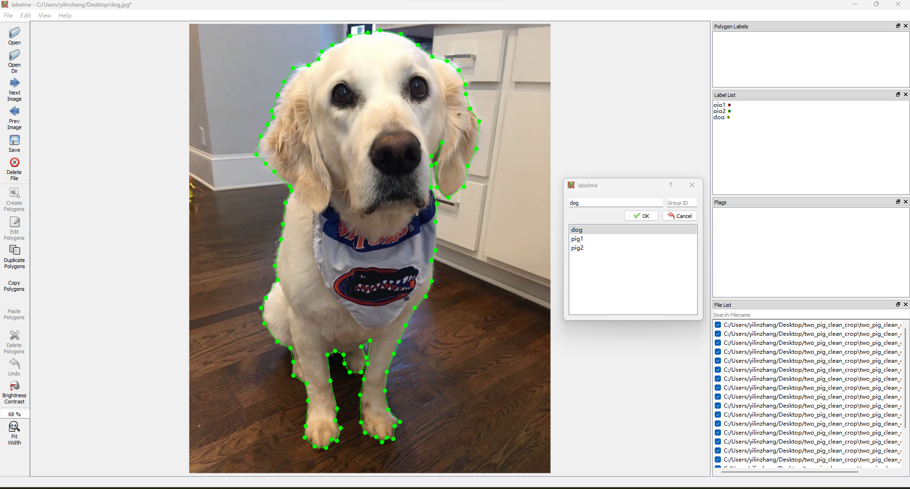

<h1 align="center">
  <br/>LabelMe
</h1>

<h4 align="center">
  Image Polygonal Annotation with Python
</h4>

<div align="center">
  <a href="https://pypi.python.org/pypi/labelme"></a>
  <a href="https://pypi.org/project/labelme"></a>
  <a href="https://github.com/wkentaro/labelme/actions"></a>
</div>

<div align="center">
  <a href="#description"><b>Description</b></a> |
  <a href="#features"><b>Features</b></a> |
  <a href="#requirements"><b>Requirements</b></a> |
  <a href="#installation"><b>Installation</b></a> |
  <a href="#usage"><b>Usage</b></a>
  
</div>

<br/>

<div align="center">
  
</div>

## Description

Labelme is a graphical image annotation tool inspired by <http://labelme.csail.mit.edu>.  
It is written in Python and uses Qt for its graphical interface.

 


## Features

-  Rectangular and Point Annotation: Labelme supports rectangle and point annotation, which can be useful for tasks such as object detection or key point detection. 
-  Image Labeling: With Labelme, you can add labels to your annotations. This can be useful for tasks that involve identifying or classifying different types of objects in an image.
-  Annotation Saving: Annotations can be saved as a JSON file, which includes the image data in base64 format. This is convenient because it means you can handle annotated data as single JSON file.
-  GUI customization (predefined labels / flags, auto-saving, label validation, etc). 
-  Customizable Label List: The list of labels can be pre-defined by using a text file. This helps in ensuring consistency of labels when working on a large dataset.
-  Python Library: In addition to the graphical interface, Labelme also includes a Python library. This means you can incorporate Labelme functionality into your own Python scripts or applications.
-  Support for Mask Images: Labelme can generate mask images from annotations. The masks can be used for various types of computer vision tasks such as image segmentation.


## Requirements

- Ubuntu / macOS / Windows
- Python3
- [PyQt5 / PySide2](http://www.riverbankcomputing.co.uk/software/pyqt/intro)


## Installation

1. Install [Anaconda](https://www.continuum.io/downloads)
2. Make sure you have Python installed on your machine. The recommended version is Python 3.7 or higher. You can check the version of Python by running the following command in your terminal:

```bash
python --version
```
If Python is not installed, please download it from the [official Python](https://www.python.org/).

3. Upgrade pip to the latest version:
   
```bash
pip install --upgrade pip
```
4. Install the labelme package. Now, you can install labelme by running the following command:
```bash
pip install labelme
```
5. Once you've completed these steps, you can test the installation by running:
```bash
labelme
```
This command should open the labelme window.
## Usage

Run `labelme --help` for detail.  
The annotations are saved as a [JSON](http://www.json.org/) file.

```bash
labelme  # just open gui

# tutorial (single image example)
cd examples/tutorial
labelme apc2016_obj3.jpg  # specify image file
labelme apc2016_obj3.jpg -O apc2016_obj3.json  # close window after the save
labelme apc2016_obj3.jpg --nodata  # not include image data but relative image path in JSON file
labelme apc2016_obj3.jpg \
  --labels highland_6539_self_stick_notes,mead_index_cards,kong_air_dog_squeakair_tennis_ball  # specify label list

# semantic segmentation example
cd examples/semantic_segmentation
labelme data_annotated/  # Open directory to annotate all images in it
labelme data_annotated/ --labels labels.txt  # specify label list with a file
```

For more advanced usage, please refer to the examples:

* [Tutorial (Single Image Example)](examples/tutorial)
* [Semantic Segmentation Example](examples/semantic_segmentation)
* [Instance Segmentation Example](examples/instance_segmentation)
* [Video Annotation Example](examples/video_annotation)

## Thank you
